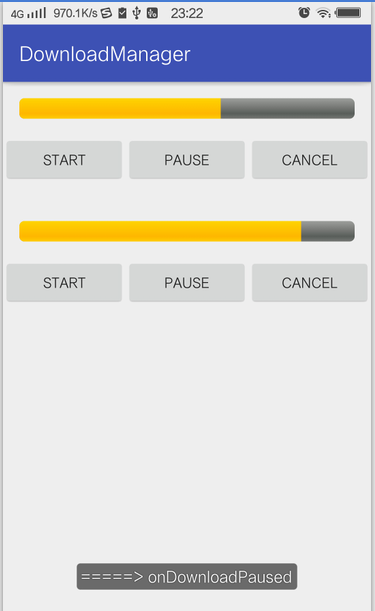

## DownloadManager 文件下载器
多线程下载，支持断点续传，分为Android和Java两个版本。



## 用法

```
RequestCall call = new GetBuilder()
        .name(name)
        .folder(folder)
        .uri(url)
        .tag(tag)
        .build();
DownloadManager.getInstance(this).start(call, new FileCallBack() {
    @Override
    public void onStart(String tag) {
        L.d("=====> onStart " + tag);
    }

    @Override
    public void onDownloadProgress(String tag,long finished, long totalLength, int percent) {
        L.d("=====> onDownloadProgress: " + percent);
    }

    @Override
    public void onDownloadPaused() {
        L.d("=====> onDownloadPaused: " );
    }

    @Override
    public void onDownloadCanceled() {
        L.d("=====> onDownloadCanceled: " );
    }

    @Override
    public void onDownloadFailed(DownloadException e) {
        L.d("=====> onDownloadFailed: " + e.getErrorMessage());
    }

    @Override
    public void onDownloadCompleted(File file) {
        L.d("=====> onDownloadCompleted: " + file.getAbsolutePath());
    }
});
        
```

## 简单调用
如果只想获取下载进度和结果，还可以这样调用。
```
new GetBuilder()
	.name("JOKER_山本彩.mp4")
	.folder(new File("F:/"))
	.uri(url)
	.tag(tag)
	.build()
	.execute(new FileCallBack() {
		@Override
		public void onStart(String tag) {
			// UI Thread
		}

	    @Override
		public void onDownloadProgress(String tag, long finished, long totalLength, int percent) {
			// UI Thread
		}

		@Override
		public void onDownloadFailed(DownloadException e) {
			// UI Thread
		}

		@Override
		public void onDownloadCompleted(File file) {
			// UI Thread
		}
	});
```

## 其他API
1. 取消一个下载任务
```
DownloadManager.getInstance(this).cancel(tag);`
```

2. 暂停一个下载任务
```
DownloadManager.getInstance(this).pause(tag);
```
3. 取消所有下载任务
```
DownloadManager.getInstance(this).pauseAll();
```
4. 暂停所有下载任务
```
DownloadManager.getInstance(this).cancelAll();
```

## 依赖
Android: 拷贝libs目录`downloader-android-1.0.jar`到项目引用即可。

Java: 拷贝libs目录`downloader-java-1.0.jar`到项目中，该jar需要额外引入`sqlite-jdbc.jar`，本项目使用的版本是`sqlite-jdbc-3.8.11.1.jar`。


## License
    Copyright 2017 wangli

    Licensed under the Apache License, Version 2.0 (the "License");
    you may not use this file except in compliance with the License.
    You may obtain a copy of the License at
 
        http://www.apache.org/licenses/LICENSE-2.0
 
    Unless required by applicable law or agreed to in writing, software
    distributed under the License is distributed on an "AS IS" BASIS,
    WITHOUT WARRANTIES OR CONDITIONS OF ANY KIND, either express or implied.
    See the License for the specific language governing permissions and
    limitations under the License.